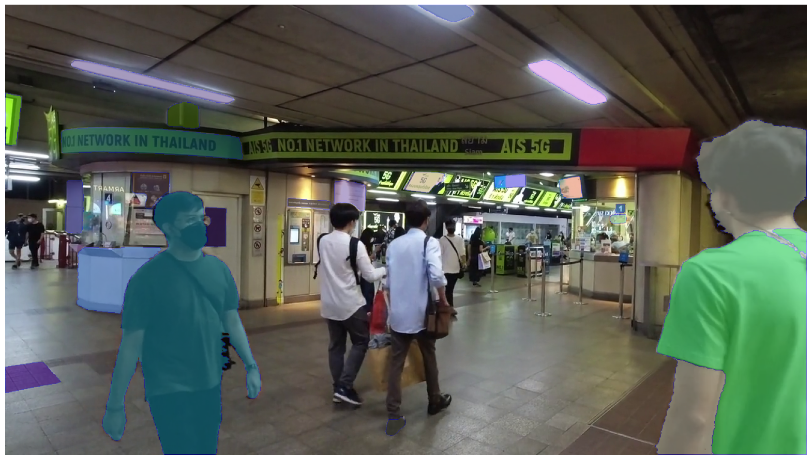
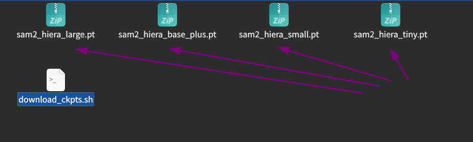

# `segment-anything-2`を試す

## はじめに
Metaは2024年7月29日に、`Segment Anything Model 2`を発表しました。

Introducing Meta Segment Anything Model 2 (SAM 2)
https://ai.meta.com/sam2/

ここでは公式GitHubに用意されているノートブックのうち、画像内の自動マスク生成を試したいので、`Automatically generating object masks with SAM`を参考にします。

以下の画像は出力の一例です。



## インストール手順
インストールは[GitHubの公式ページ](https://github.com/facebookresearch/segment-anything-2?tab=readme-ov-file#installation)を参考に行います。


ダウンロードされたモデル群



> ![NOTE]
> 後のノートブック実行の際、`matplotlib`, `cv2`がインストールされていないとエラーが発生しますので、`matplotlib`をインストールしておきます。
> 
> ```
> (.venv) user@user:~/ドキュメント/segment-anything-2/segment-anything-2$ pip install matplotlib opencv-python
> ```

## `Automatically generating object masks with SAM`
ここでは`画像内の自動マスク生成`を試したいので、[`Automatically generating object masks with SAM`](https://github.com/facebookresearch/segment-anything-2/blob/main/notebooks/automatic_mask_generator_example.ipynb)を参考にします。

> (自動翻訳)
> SAM によるオブジェクト マスクの自動生成
> 
> SAM 2 はプロンプトを効率的に処理できるため、画像上で多数のプロンプトをサンプリングすることで画像全体のマスクを生成できます。
> 
> SAM2AutomaticMaskGenerator クラスはこの機能を実装します。これは、画像上のグリッド内の単一点入力プロンプトをサンプリングすることによって機能し、SAM はそれぞれのプロンプトから複数のマスクを予測できます。
> 次に、マスクは品質のためにフィルタリングされ、非最大抑制を使用して重複が排除されます。
> 追加のオプションにより、画像の複数のクロップに対して予測を実行したり、マスクの後処理を行って小さな切断された領域や穴を除去したりするなど、マスクの品質と量をさらに向上させることができます。


## 参考文献
- [SAM 2: Segment Anything in Images and Videos](https://github.com/facebookresearch/segment-anything-2?tab=readme-ov-file)